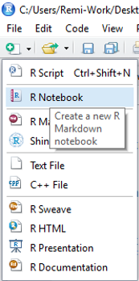
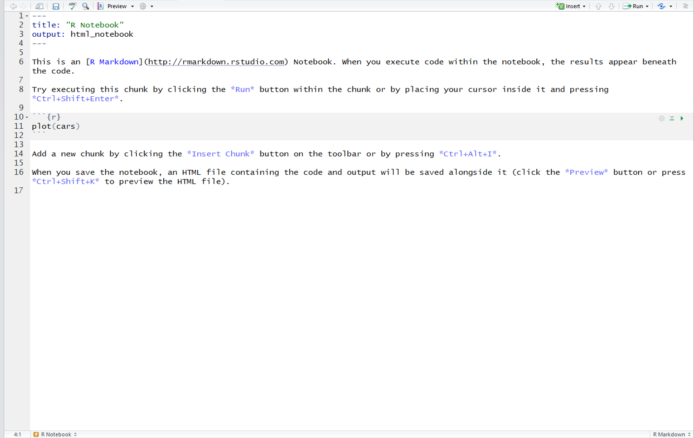
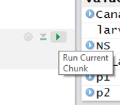
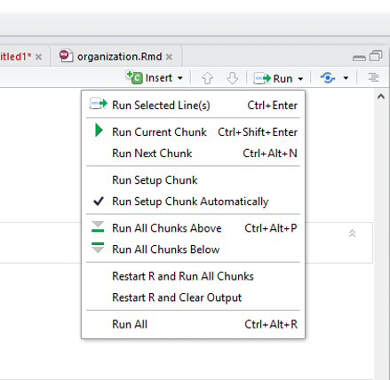

[<<BACK](https://remi-daigle.github.io/2017-CHONe-Data/)

Literate programming is in essence to treat programming as writing human readable literature. Yesterday we learned how to write scripts and I explained that you should always write ample comments with `#` to explain what you were doing in real words. Literate programming flips that on it's head. It intersperses snippets of code throughout human readable (and nicely formatted) text.

This type of programming maximizes reproducibility since the focus is on human readability while still maintaining functionality. In my [Remi] opinion, using interactive literate programming in R in the form of R notebooks is by far the most efficient workflow for science. Using R notebooks, you can go from raw data to a fully-formatted publication-ready pdf file using a single document. However, my preference is simply to effectively write an exhaustively detailed methods section more akin to a lab notebook than a polished manuscript. I then submit this as an appendix to my real manuscript.

R notebooks are written in "R Markdown" (`.Rmd`) which is really just markdown with chunks of R code interspersed in the text. Markdown is a lightweight markup language with plain text formatting syntax. It's designed so that it can be converted to HTML and many other formats (e.g. `.pdf`, `.docx`). You've probably already used markdown before and not even realized it since it is so ubiquitous on the web.

Also, *this entire workshop website was developped using R Markdown*!

But that's enough talk, let's do it! The first step is to start a new notebook.



Have a read through of what is on that template, it's quite informative



That top bit between the two lines with `---` is the YAML header (YAML stands for "YAML Ain't Markup Language", seriously...), it essentially contains options about the entire document and how that will be output. Don't worry about it too much for now.

The text in the white sections is markdown, pretty much plain text with some basic formatting. Here's a few examples of formatting options, even LaTeX equations (they are just highlighted above and formatted below because I had to make them look like code so markdown would not format them, but feel free to past these into your notebook):

```
# Heading 1
## Heading 2
### Heading 3
#### Heading 4

*italics*

**bold**

~~strikethrough~~

~subscript~

^superscript^


[link](www.link.com)

$E = mc^2$

$$y = \mu + \sum_{i=1}^p \beta_i x_i + \epsilon$$

```

# Heading 1
## Heading 2
### Heading 3
#### Heading 4

*italics*

**bold**

~~strike-through~~

~subscript~

^superscript^


[link](www.link.com)

$E = mc^2$

$$y = \mu + \sum_{i=1}^p \beta_i x_i + \epsilon$$

Again, there is much more on the R Markdown [site](http://rmarkdown.rstudio.com/lesson-1.html) and [cheatsheet](https://www.rstudio.com/wp-content/uploads/2015/02/rmarkdown-cheatsheet.pdf)

Up to now not super exciting, but the real power is that you can write R code and run it interactively inside a notebook. The part highlighted in blue preceded by three back ticks and the `{r}` and followed by three more back ticks is called an R chunk. You can write a few lines of R code and run it by hitting the run button in the chunk:



You can also see a lot more options in the run button at the top right:



This gets really useful as you are developing your analysis since you can run your entire analysis by running all the chunks, or if you are working part way through a document, you can run just the chunks up to the point where you are working. The game changer for me is that the output of the chunk is printed to the notebook interactively. So you can make some changes to a chunk and rerun just the chunk or even just some specific lines of the chunk (that works just like in a script, highlight and `Ctrl` + `Enter` or `Command` + `Enter`) without having to re-run your entire analysis (so long as the current chunk doesn't overwrite something).

Also, instead of commenting out lines of code, you can 'turn off' whole chunks by setting options in the curly brackets `{r, eval = FALSE}`. This is useful if a certain part of your analysis takes a really long time, you can run that chunk once, save the output to file, then set `eval = FALSE`, that way you can still have the code there, but you can just load the output and continue with your analysis.

I also really appreciate being able to pop out the file in a new window with the . That way I can work on my notebook interactively, which has my markdown text, my R code, and it's output, and it's full screen!

```{r}
#You can also run inline code like this `r x <- c(2,3,4)` and then say things like the mean is `r mean(x)`
```
 Which becomes:
You can also run inline code like this `r x <- c(2,3,4)` and then say things like the mean is `r mean(x)`

That is quite powerful since doing something like adding a data point upstream will not make your text incorrect. 

# Rendering

One of the cool things about working on a notebook is that when you hit the  button it will render your `.rmd` 'as is' without having to re-run your analysis. Sure there are pros and cons with that, if you fudged something it renders the output that is already in the notebook. To ensure that everything is reproducible, you may want to make sure you run all your chunks before finalizing everything. Alternatively, click on the little down arrow on the  button and click on 'Knit to PDF' (or HTML or Word) and it will run all the chunks automatically. 

You've also just discovered one of the strengths of working in R Markdown, you can write one file and have many different possible outputs. Of course, when you output to pdf or word, your output will lose any interactive features (e.g. plotly, leaflet, etc)

Finally, when you render as either html or a notebook, it's easy to post that on to GitHub as your own website so you can share what you've done with colleagues, supervisors, the public, whoever! We'll cover that in the [Data Archiving & Version Control](https://remi-daigle.github.io/2017-CHONe-Data/versioncontrol.nb.html) lesson this afternoon

[<<BACK](https://remi-daigle.github.io/2017-CHONe-Data/)
