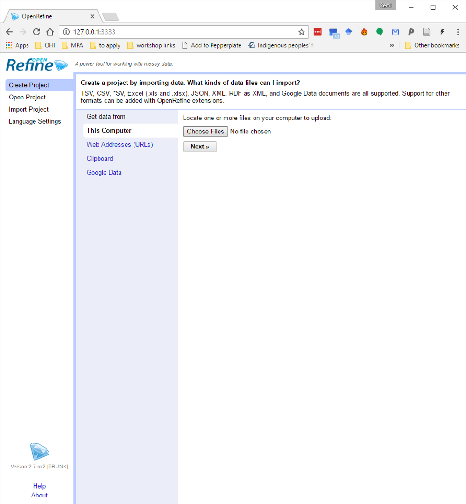
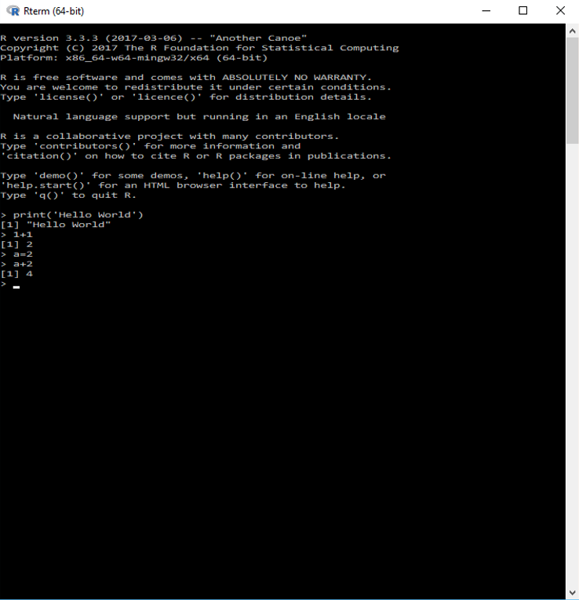
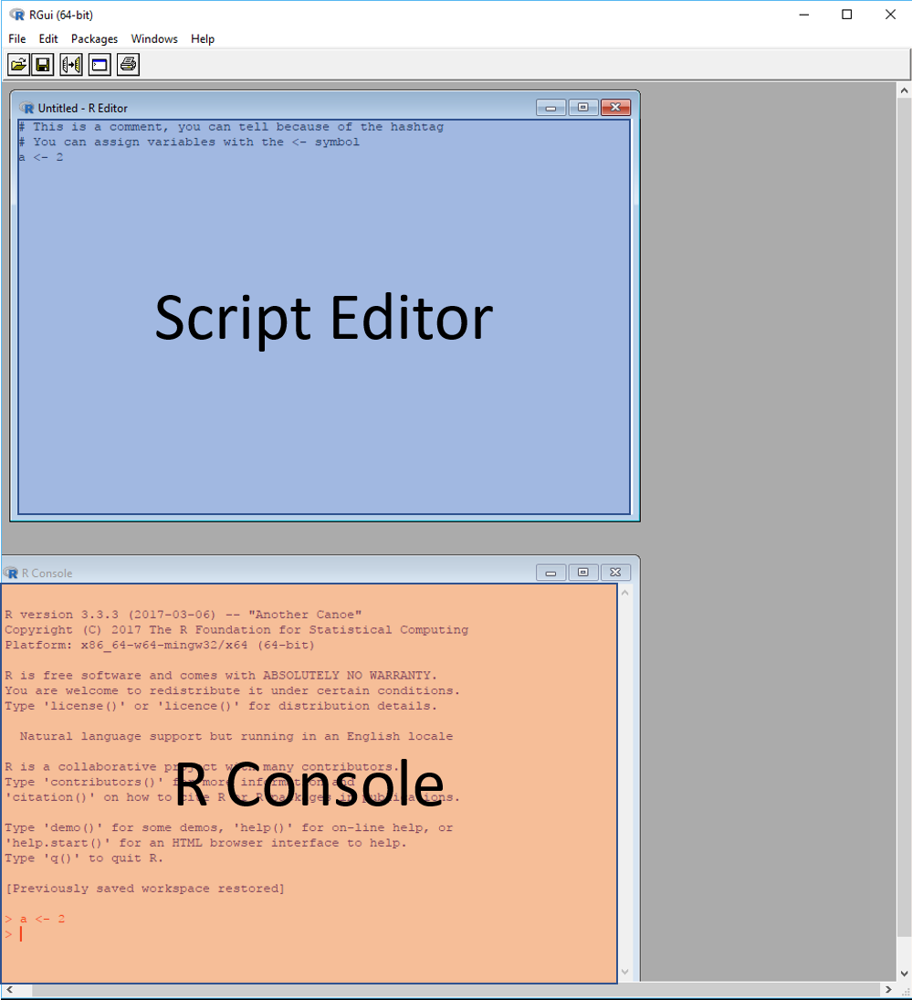
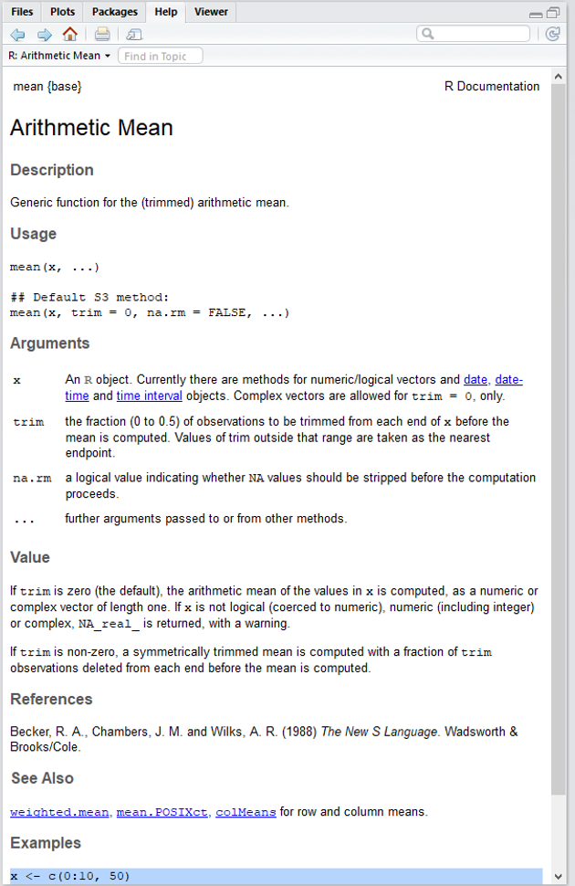
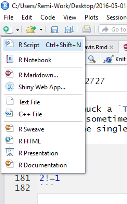

[<<BACK](https://remi-daigle.github.io/2017-CHONe-Data/)

# The reproducible workflow

My unofficial mantra (again):


In  [Data organization with spreadsheets](https://remi-daigle.github.io/2017-CHONe-Data/organization.nb.html) we learned how to write down our data, avoid common errors, and how to save your data so that you and others can read and understand it later. 

Now let's learn how to write down **ALL** the steps needed to take you from your raw data to publication quality figures. That's the key to reproducibility, if every step is written down, then others can reproduce your findings! Below, You will learn how to clean your data in a reproducible way using OpenRefine and R.

> **Pro-tip**
>
> After spending all that time entering your raw data, **NEVER** change it again.
>
> - Do not edit the data
> - Do not edit the column headers
> - Do not remove 'outliers'
> - Do not do calculations directly on the raw data
>
> Store your data in a `raw_data` directory (folder) in your project directory, and never save/write over it!

I advise you archive your data immediately upon collection to reduce risk of data loss. [Zenodo](https://zenodo.org/) and [Figshare](https://figshare.com/) both offer different **free** options for archiving your raw data **permanently** and have some awesome options for embargoes, restricted access, or even private storage to suite your privacy needs. More detail can be found in the [Data Archiving & version controls](https://remi-daigle.github.io/2017-CHONe-Data/versioncontrol.nb.html) lesson.

](pictures/Branch.png)

By now I've probably said the words reproducible and reproducibility so often that it's starting to lose meaning. Trust me, this is important! (or don't trust me and read ["A manifesto for reproducible Science"](https://www.nature.com/articles/s41562-016-0021)). By not 'hiding' you workflow, you help:

- **yourself** in the future since:
    - you can easily re-run your analysis after 'reviewer 3' makes you add one data point
    - you will be able to easily adapt your method
    - you will receive higher citations since someone may cite you for your methods/data
    - you will appear like an honest/better scientist 
- **other scientists** since:
    - they will be able to reuse/adapt your methods/data
    - they will be better able to judge your methods as appropriate (for your data during review, or their data in the future)
- **'Science'** since
    - discoveries are published more efficiently
    - findings are 'correct' more often
    - there is increased trust in 'Science', which we badly need right now
    
    
# OpenRefine

OpenRefine (formerly Google Refine) is a powerful tool for working with messy data: cleaning it; transforming it from one format into another. It's effectively a reproducible way to work in a spreadsheet, no coding is required on your part since it generates a script that details what you did to the data, step by step.

First, let's open OpenRefine. You'll notice it opens in the browser, but it's running locally (does not require internet connection).


The first step is to load your data and to create a project. If you haven't done so already, please download the [zip file](https://github.com/remi-daigle/2017-CHONe-Data/archive/gh-pages.zip) the entire  github [project repository](https://github.com/remi-daigle/2017-CHONe-Data/) (contains data files, and all the R scripts used to make this very website!) and extract it somewhere convenient.

In OpenRefine, click `Choose Files` and find the `larval abundance.csv` which is in the `rawdata` directory of the project folder. Then click on the `Create Project` button (you may want to rename the project).

## Data Cleaning
You are now working on a copy of the raw data and changes you make in OpenRefine will not 'break' your original raw data. In here you can do all the regular 'spreadsheet-y' things. You can edit specific cells, sort, undo/redo, view subsets of your data (facet), etc. But the more powerful functions of OpenRefine are: 

- **Cluster** (click on column header arrow, then `Edit cells > Cluster and Edit...`) which means “finding groups of different values that might be alternative representations of the same thing”. For example, the two strings “New York” and “new york” are very likely to refer to the same concept and just have capitalization differences. 

- **Whitespace management** (click on column header arrow, then `Edit cells > Common transforms > Trim leading and trailing whitespace.` and `Edit cells > Common transforms > Collapse consecutive whitespace.`) Strings with spaces at the beginning or end are particularly hard for we humans to tell from strings without, but the blank characters will make a difference to the computer. We usually want to remove these. 


## Reproducibility

OpenRefine saves every change, every edit you make to the dataset in a file you can save on your machine. If you had 20 files to clean, and they all had the same type of errors, and all files had the same columns, you could save the script, open a new file to clean, paste in the script and run it. Voila, clean data.

- In the `Undo / Redo section`, click `Extract`, save the bits desired using the check boxes.
- Copy the code and paste it into a text editor. Save it as a `.txt` file.
- To run these steps on a new dataset, import the new dataset into OpenRefine, open the `Extract / Apply` section, paste in the `.txt` file, click `Apply`.

For more information and tutorials on OpenRefine, please see [Data Carpentry](http://www.datacarpentry.org/OpenRefine-ecology-lesson/)

# R and RStudio

You can do everything mentioned above in [R](http://cran.utstat.utoronto.ca/), it may at first appear more difficult to do it in R, but in my opinion, you will save time by streamlining your workflow using just one tool. I'm not at all disouraging the use of OpenRefine,it is open source and reproducible, such much kudos is due.

For this and future lessons, we will focus on achieving reproducibility by using [R](http://cran.utstat.utoronto.ca/) which is an open source language and environment for statistical computing and graphics. There are many other such languages (e.g. [Python](https://www.python.org/), [Julia](https://julialang.org/), [MATLAB](https://www.mathworks.com/products/matlab.html),etc) used by conservationists, biologist, and oceanographers; however, we believe R is currently the most widely adopted among our colleagues and also has the most convenient set of statistical tools developed for our field.

## Intro to R

In "the olden days" we ~~had to walk to school uphill both ways~~ used R in the terminal or using the built in graphical use interface (GUI). Yes, before 2011, RStudio did not exist and yes, R and RStudio are not the same thing!

R is accessible in the terminal (that thing that looks like DOS, and in case my 'old' is showing, the thing that is usually a black screen, a blinking cursor and you can only type in commands) by typing `R.exe` on Windows, or just `R` on Mac or Linux. In this way, you can type commands in one by one, or similar to what we just saw with OpenRefine, you save your steps/instuctions/commands in a plain text file (with a `.R` extension instead of `.txt`) and you can run those in the terminal by typing `Rscript.exe scriptname.R` on Windows, or just `Rscript scriptname.R` on Mac or Linux. While I don't often work in this way anymore, but this is the only option when using [Compute Canada](https://www.computecanada.ca/research-portal/national-services/compute/)'s awesome resources. Using the commands above and a little server specific magic, you can run your scripts on 100's of processors instead of the one lonely processor on your computer! I've used hundreds of years of computer time in a matter of weeks, all for free! If you are affiliated with any Canadian university, you can do this too!



R also come with it's own GUI, in which you can have a script editor, which is essentially a plain text editor, to write/develop your script and an interactive R console where you can actually execute commands. The advantage of the GUI is that you can execute the entire script ('source') or run it line by line all while recording your commands in the script file.



## Intro to RStudio

[RStudio](https://www.rstudio.com/products/RStudio/#Desktop) takes this GUI concept a bit further and provides you with several extra support window. If the idea of having windows for your environment, your files, your plots, as well as packages and a help tab all at hand does not excite you, hold on tight, you'll get there.


There's also a lot more information about RStudio on their [cheatsheet](https://www.rstudio.com/wp-content/uploads/2016/01/rstudio-IDE-cheatsheet.pdf). On the subject of cheatsheets, RStudio has developed several **super useful** [cheatsheets](https://www.rstudio.com/resources/cheatsheets/); seriously, you probably will want to print most of these and put them on the wall in your office.

## Enough talk! Let's get coding! The Fundamentals
You read my mind! However, before we get to cleaning the data, we need to cover a few R fundamentals so that what we do in later steps makes sense.

Go back to the project folder you downloaded during the [OpenRefine lesson](file:///C:/Users/Remi-Work/Desktop/2016-05-01-CHONe-Data-Carp/cleaning.html#openrefine) and open the `2017-CHONe-Data.Rproj` file. This is an R project file that allows you to set a number of options for the project (see [here](https://support.rstudio.com/hc/en-us/articles/200526207-Using-Projects)), but for our purposes just know that the project file is setting the 'working directory', it tells R where all your files are. We'll get back to that later.

In R you can do math, type the command below in your R console and hit enter:
```{r}
1+1
```

You can also assign values to variables, or in R parlance an 'object' using the `<-` symbol (shortkey `Alt` + `-`).
```{r}
a <- 2
b <- 1+2
```

You'll notice that there was no output this time there was no output. That's because the value on the right side of the `<-` symbol is assigned to a object, it goes to your environment (top right window) instead of being output to the console. In the 1+1 example above, there was no object to go to, so it defaulted to printing in the console.

You can see the contents of a object in the environment window, or by typing the object into the console. You can also use these objects like algebra
```{r}
a
b
a/b
```

Up to now, we've been dealing with numbers, but R can also deal with character string if surrounded by single or double quotation marks. According to R help (I learned this today!): "Single and double quotes delimit character constants. They can be used interchangeably but double quotes are preferred (and character constants are printed using double quotes), so single quotes are normally only used to delimit character constants containing double quotes."

```{r}
f <- "This is a character string, you can tell because of the quotation marks"
```

A object can also contain multiple values. The `:` symbol essentially means 'to'

```{r}
x <- 1:3
```

Another way to do that, with more flexibility is using the `c()`; the c is short for concatenate and the round brackets indicate that it's a function. So this concatenate function will concatenate all the 'arguments' (things inside the round brackets) which are separated by commas. You can also combine these strategies

```{r}
x <- c(1,3,5)
y <- c(1:4,6,8)
```

There are many functions, but they all follow the format `functionName(argument1,argument2,argument3,...)` where the 'arguments' are the input to the function. Some are fairly straightforward:

```{r}
mean(y)
```
But even then there are some surprises, let's look at the help file for `mean()`. To do that you can:
- if you are on the active line in the console or anywhere in a script, put your cursor on the function and press `F1`
- in the console, type `?mean` (or `??mean` if your not so sure `mean` is the name of the function)
- find the help window (one of the tabs for the bottom right window) and use the search bar
- also, when all else fails, Google is your friend!

Any method should get you to something like this:

In R in most cases you could use `=` instead of the `<-` symbol with no problems when you are assigning a value to a object. However, it is best practice to use `<-` when assigning environment objects and `=` when defining function arguments. Oh, and `NA` in R means ‘Not Available’ / Missing Values. Like so:
```{r}
x <- c(1,2,5,7,88,3,4,2,4,6,7,NA)

mean(x)

mean(x, na.rm = TRUE)
```

I also snuck a `TRUE` in there; `TRUE` and `FALSE` are called logical and are distinct from numeric or character strings. They are sometimes used as arguments values, but they can also used to test things. The `==` asks if both sides are equal (since the single `=` is already used for other things), and the `!=` asks if both sides are not equal.

```{r}
2==1
2==2
2!=1
```
## Creating your own scripts
Up until now, we've been playing in the console which means the 'instructions' we need to save to reproduce our science are lost (well not really, they can be retrieved from the History tab in the top right, or the console if it hasn't rolled off the screen). It is a good idea to develop your analysis using a script file (those simple text files with the `.R` extension I was talking about earlier) because you can save your code easily.

To create a new script, your can click on the little paper with the plus symbol (see below), or you can hit `Ctrl`+`Shift`+`N` (Windows), or `Command`+`Shift`+`N` (Mac), and if that's not enough options, you can click `File > New File > New Script`



These scripts are designed to read by R from top to bottom when you hit the  button, or `Ctrl`+`Shift`+`S` (Windows), or `Command`+`Shift`+`S` (Mac). Alternatively, you can run portions of your code with `Ctrl`+`Enter` (Windows), or `Command`+`Enter` (Mac) and either putting your cursor on a line to run the entire line, or highlighting a subsection of code to run just that portion.

>**Pro-tip**
>If you don't want R to read something, us the `#`. Anything that is preceded by a `#` is regarded as a 'comment' by R and it does not try to execute those lines (i.e. R ignores anything after a `#`). 
> This is also useful if you want to avoid running a few lines of code when you are developing your script. Instead of typing a `#` in front of each line of code, you can highlight the lines you want commented out and hit `Ctrl`+`Shift`+`C` (Windows), or `Command`+`Shift`+`C` (Mac). Magic!

Commenting is super useful to include human readable instructions/documentation in your code. Let's give this a try, write this chunk of code into your script, then run it line by line.
```{r}
x <- 1

x <- 2

# x <- 3
```
What is the value of `x` after running all the lines and why?

## Indexing and dimensions


## Making your own functions


## What are 'packages'?


## Reading in data


# Homework
install all the packages


[<<BACK](https://remi-daigle.github.io/2017-CHONe-Data/)
