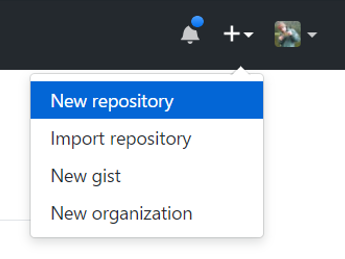
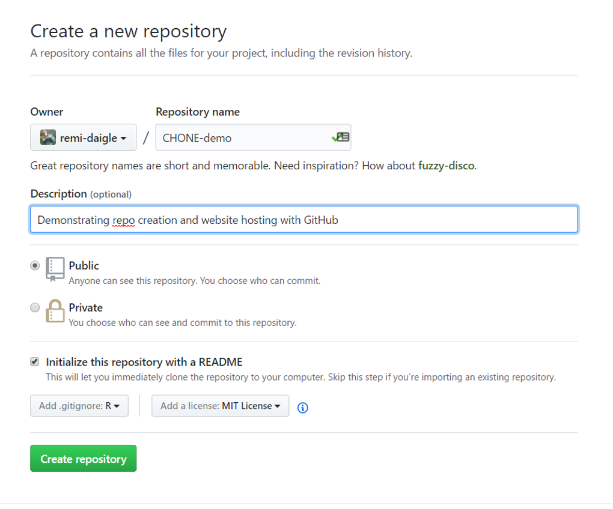
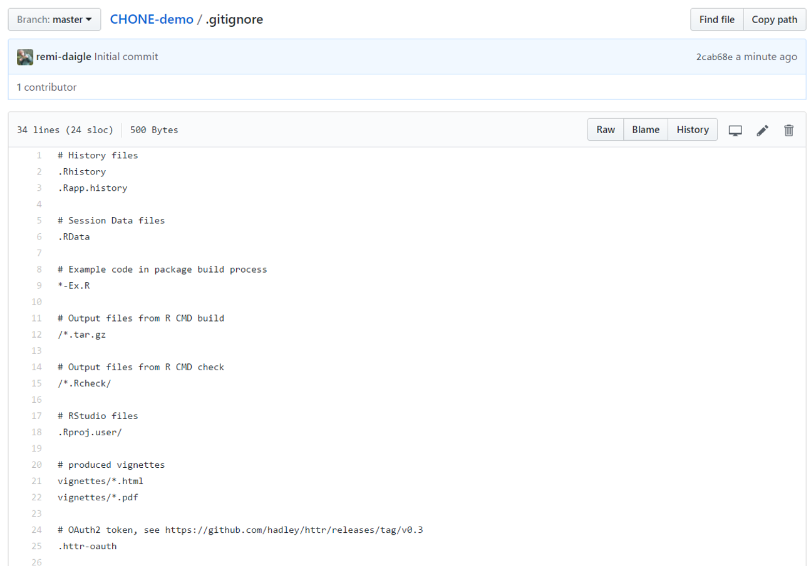
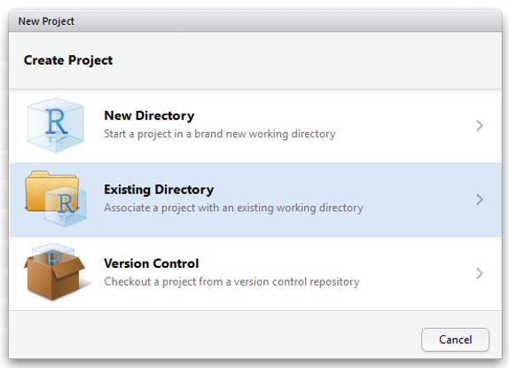
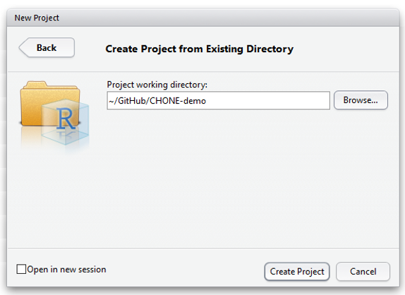
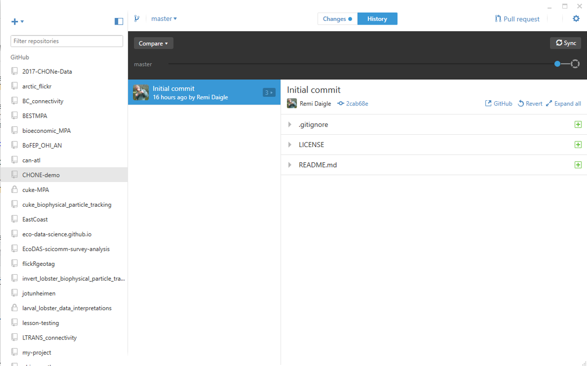
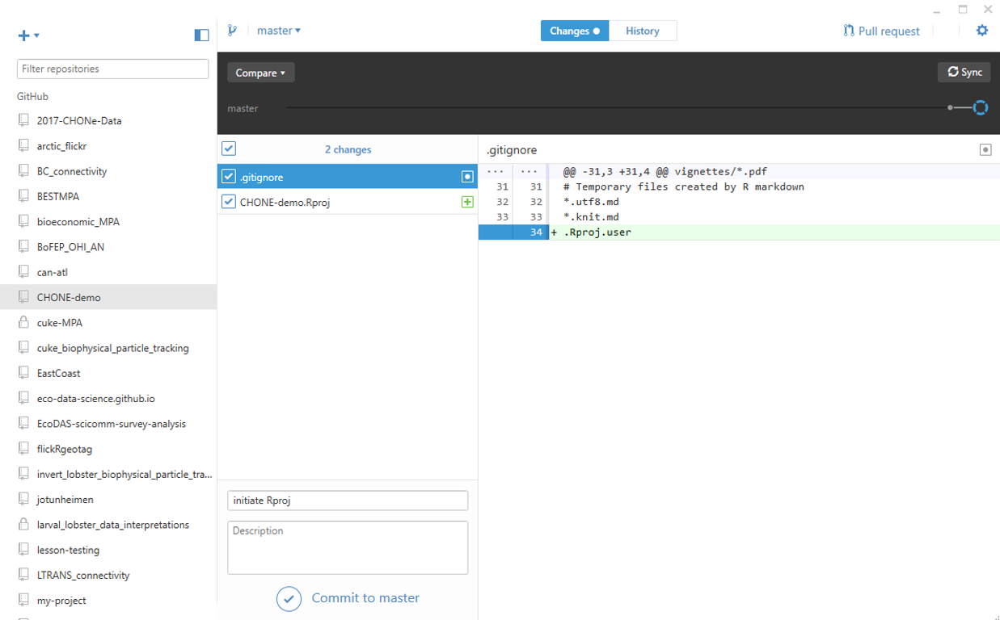
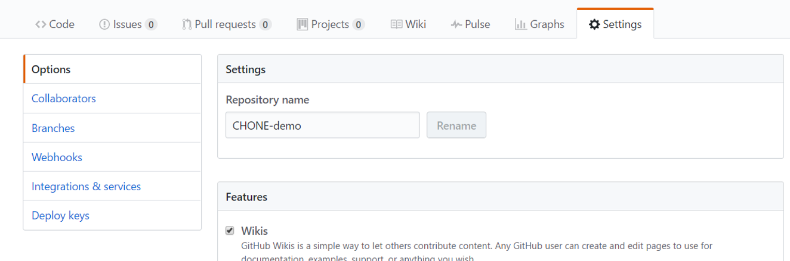
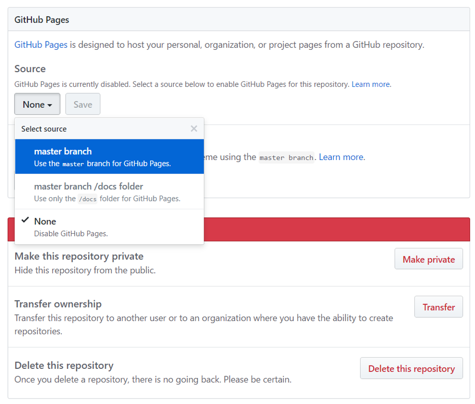

[<<BACK](https://remi-daigle.github.io/2017-CHONe-Data/)

# Data repositories

Please Download:

[PDF](https://github.com/remi-daigle/2017-CHONe-Data/raw/gh-pages/Angela/DataWorkshop_Sharing.pdf)

[PPT](https://github.com/remi-daigle/2017-CHONe-Data/raw/gh-pages/Angela/DataWorkshop_Sharing.pptx)

# Version Control

## What is version control?

Version control is a framework by which by which you can track changes to a file, of set of files. We are essentially trying to avoid this:

And we're aiming to nudge you along a little further than this:

But, like most XKCD comics, it contains some serious wisdom.

While there are other version control system out there, in our opinion Git & Github seem to have the best combination of features for scientists. However, if you wish to use a different version control system, go for it, many of the concepts we're learning about here will be transferable.

First a quick clarification about the tools we are using:

- [Git](https://git-scm.com/) is a free and open source distributed version control system designed to handle everything from small to very large projects with speed and efficiency.
- [GitHub](https://github.com/) Online project hosting using Git. Includes source-code browser, in-line editing, wikis, and ticketing. Free for public open-source code.
- [GitHub Desktop App](https://desktop.github.com/) GitHub Desktop is a seamless way to contribute to projects on GitHub

So Git is the protocol that we are using to do the actual version control (on our computer) and we are hosting our project on GitHub (the website) so we can keep a backup in the cloud and share our work (both in terms of housing all the code, but also for hosting your own websites). Finally, we are using the GitHub Desktop App to allow us to sync our local files to the GitHub website

## How does version control work?

Version control systems start with a base version of the document and then save just the changes you made at each step of the way. You can think of it as a tape: if you rewind the tape and start at the base document, then you can play back each change and end up with your latest version.

[Changes Are Saved Sequentially](http://swcarpentry.github.io/git-novice/fig/play-changes.svg)

Once you think of changes as separate from the document itself, you can then think about “playing back” different sets of changes onto the base document and getting different versions of the document. For example, two users can make independent sets of changes based on the same document.

[Different Versions Can be Saved](http://swcarpentry.github.io/git-novice/fig/versions.svg)

If there aren’t conflicts, you can even play two sets of changes onto the same base document.

[Multiple Versions Can be Merged](http://swcarpentry.github.io/git-novice/fig/merge.svg)

A version control system is a tool that keeps track of these changes for us and helps us version and merge our files. It allows you to decide which changes make up the next version, called a commit, and keeps useful metadata about them. The complete history of commits for a particular project and their metadata make up a repository. Repositories can be kept in sync across different computers facilitating collaboration among different people.

## How to use version control

By default git 'watches' not just a single file; rather, it looks for changes in any file in an entire directory (except those identified in the `.gitignore`). So I tend to set it up in a way that makes git watch the whole project directory (i.e. the folder that contains the .Rproj file). This 'watched' folder is then called a git repository (repo for short).

We can create a new repository any number of ways (git command line, GitHub Desktop App, RStudio, etc), but I'm going to show you my favorite workflow to create a whole new repository from scratch:

1. Make a new repo on GitHub (the website)
2. Clone that repo to your computer
3. Create an .Rproj in RStudio
4. Sync (pull), Edit files, commit, sync (push), repeat!

### Make a new repo on GitHub (the website)

Open up GitHub (and login), then click the 'New repository' button

Then set the repo name, a description of the project (optional), choose whether to make the repo public or private (see more in ), check the README box (the readme is a great place to describe the project even more, add metadata, etc). I'll explain the `.gitignore` option below. Finally, I usually choose the `MIT` license which according to GitHub: "The MIT License is a permissive license that is short and to the point. It lets people do anything they want with your code as long as they provide attribution back to you and don’t hold you liable." (This is similar to the CC-BY licence we recommend for data)

The `.gitignore` is a plain text file (that you can edit as you please) that tells which files, or types of files to ignore when 'watching' your folder. Since I work predominantly in R, I choose to use the `.gitignore` for R which handily ignores things that you would normally want git to ignore while working in R.

Congrats! You have created a repository!

### Clone that repo to your computer

Clone your repository to your computer so you can easily work on your files. That is hopefully a two click deal if you have already configured the GitHub Desktop App (login, etc), click on `Clone or Download`, then `Open in Desktop`, and finally choose where to put that repo.

### Create an .Rproj in RStudio

Now you have a 'project folder' but RStudio doesn't know about it! First, open RStudio and start a new project.

Choose `Existing Directory` since you already have a project folder.

Browse to where you put your repo earlier and click `Create Project`.

You now have a fully functional portable project folder that is easy to move and/or use for collaboration and/or is a good start towards creating a reproducible project.

Remember what I said when I talked about [Readin in data](https://remi-daigle.github.io/2017-CHONe-Data/cleaning.html#reading_in_data), when reading/writing files, always code relative to where the the `.Rproj` file is (i.e. the root of your project folder). 

### Sync (pull), Edit files, commit, sync (push), repeat!

Let's do a quick tour of the GitHub Desktop App before we start using it. The app has 2 maine tabs that you can toggle at the top, `Changes`, and `History`. Additionally, regardless of which tab you're on there's the repo menu on the left that shows you which repos the app knows about (don't be surprised if you have less than me!) as well as the dark grey visual history of the repository.

Either way you look at it the history is very short! There is only the one commit called `Initial commit` where I added 3 files (the green +'s). A commit is essentially a saved version of your entire project repository. If you click on the little arrow next to each file, you can see what changes where made (green +'s for additions and red -'s for deletions). In this case I created the new files, so all the lines show up as additions.

The `Changes` tab shows you what changes you have made since your last commit. Let's commit the changes we made by creating the `.Rproj` file. Fill in the `Summary` box  with **something descriptive** of the changes you just made.

That's all there is to it!

> **Pro-tip**
> Now the order of operations "Sync (pull), Edit files, commit, sync (push), repeat" is really important. Before you start working, you want to make sure you are working on the latest version of your repo (less relevant if you are the only one working on your repo on only one computer, but still a good habit), so you are going to want to pull down (or sync) the latest changes from GitHub (the website) before you start working. You also will want to commit those changes before pulling down (or syncing) again since un-commited changes can be lost if they are overwritten by a changed file on Github. Finally, don't forget to push (sync) your changes to GitHub so that your collaborators can see/use them.

# Putting it all together

I want you to build something like [this](https://remi-daigle.github.io/CHONE-demo/index.nb.html)

Once you have knitted your html file, go to your repository settings on GitHub.

And set your master branch as the source.

# Become a GitHub power user!

[Branches](https://guides.github.com/introduction/flow/) and [Forks](https://guides.github.com/activities/forking/) are treated very differently most, but I see them as almost identical. The only real difference

Using the [Issues](https://guides.github.com/features/issues/) tab on GitHub as your 'to-do' list

Archiving your code with [Zenodo](https://guides.github.com/activities/citable-code/)

# Student developer pack and Educational discount

GitHub has put together a suite of free tools for students called the [Student developer pack](https://education.github.com/pack), the most important of which is the option to have unlimited free private repositories on GitHub!

Even as a non-student, you can ask for an [educational discount](https://education.github.com/discount_requests/new) if you involved in education/research which usually grants those same free private repos!

[<<BACK](https://remi-daigle.github.io/2017-CHONe-Data/)
